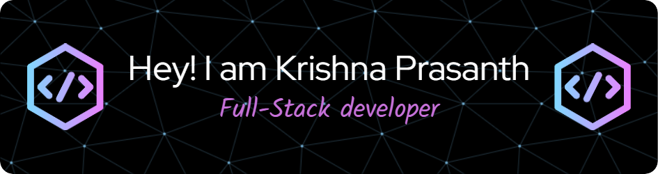

  

# 💫 About Me:
Passionate Web Developer | Crafting Digital Experiences with Innovation  🌐 Welcome to my Github profile! I'm a dedicated and passionate web developer with a strong commitment to creating exceptional online experiences. 💻  🚀 As a technology enthusiast, I thrive on staying at the forefront of web development trends and harnessing the latest tools and technologies to build engaging and dynamic websites. My mission is to turn digital dreams into reality.  🤝 Collaboration and communication are at the core of my work philosophy. I thrive in team environments and value the power of cross-functional collaboration, always seeking opportunities to learn and grow from my peers.  🌟 If you're looking for a passionate web developer who can transform your ideas into captivating online solutions, let's connect! I'm excited to explore new opportunities and create digital experiences that make a lasting impact.  Let's build the web of the future together! 👋  #WebDevelopment #PassionForCode #DigitalExperiences #WebDeveloper #Innovation

## 🌐 Socials:
 

# 💻 Tech Stack:
                     
# 📊 GitHub Stats:
 
 

### ✍️ Random Dev Quote

### 😂 Random Dev Meme

---

<!-- Proudly created with GPRM ( https://gprm.itsvg.in ) -->
